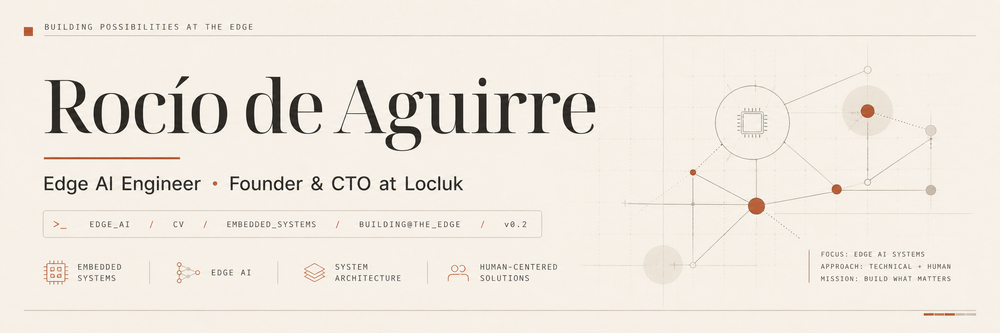

  

## Hola, soy Rocío.

Soy ingeniera electrónica y construyo sistemas inteligentes que tienen que funcionar fuera del laboratorio.

Trabajo principalmente en la intersección entre **Edge AI, Computer Vision, sistemas embebidos e infraestructura para modelos de IA**, con especial interés en llevar modelos al mundo físico y hacer que funcionen bajo restricciones reales.

Actualmente soy **Founder & CTO de Locluk**, donde desarrollamos tecnología de inteligencia artificial aplicada a cámaras y sistemas de seguridad.

### En qué trabajo

- **Edge AI** — inferencia y procesamiento cerca de donde se generan los datos.
- **Computer Vision** — sistemas que interpretan video y escenas del mundo real.
- **Embedded Systems** — hardware, firmware e integración entre sensores, cómputo y software.
- **AI infrastructure** — herramientas y arquitecturas para entrenar, desplegar y operar modelos.
- **System design** — llevar una idea desde el problema hasta un sistema que efectivamente pueda funcionar.

### Cómo trabajo

`understand first → build second`

Me interesa entender bien el problema, prototipar, medir, encontrar los límites del sistema y volver a iterar.

No trabajo solamente sobre modelos: me interesa el sistema completo que los hace útiles.

---

[Website](https://rodeaguirre.vercel.app/) ·
[LinkedIn](https://www.linkedin.com/in/rodeaguirre/) ·
[YouTube](https://www.youtube.com/@rodeaguirre) ·
[Instagram](https://www.instagram.com/rodeaguirre/)
